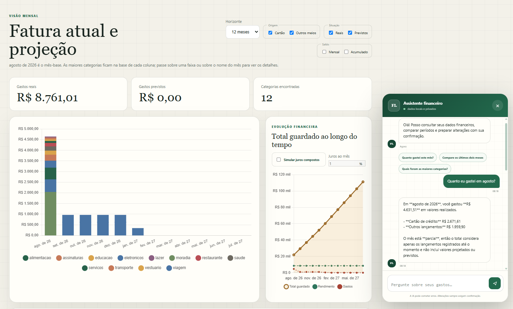

# Controle de Finanças



Aplicação local para importar faturas em PDF, categorizar transações,
acompanhar fluxo de caixa e consultar ou alterar lançamentos por meio de um
assistente financeiro com confirmação humana.

## Funcionalidades

- registro, processamento, revisão e importação versionada de faturas;
- dashboard mensal com categorias, parcelas, recorrências e projeções;
- cadastro de rendimento, valor guardado e lançamentos manuais;
- categorização por transação ou estabelecimento;
- assistente de leitura com cálculos financeiros determinísticos;
- agente operacional para criar, atualizar e remover lançamentos;
- human-in-the-loop (HITL) persistente antes de qualquer escrita do agente;
- ambiente de demonstração isolado com dados fictícios;
- diagnósticos, auditoria local sanitizada e backup dos dados.

## Arquitetura do software e dos agentes de IA

.jpg)

O serviço web segue arquitetura hexagonal: regras e portas ficam em
`application` e `domain`; HTTP, filesystem, parser, IA e bancos ficam nos
adaptadores. O PostgreSQL é dividido nos schemas `financeiro`, `spend_label` e
`cash_flow`.

Mais informações sobre as decisões de arquitetura estão na
[documentação dos agentes](services/ai_agent/README.md).

### Serviços do Docker Compose

| Serviço | Responsabilidade |
| --- | --- |
| `db` | PostgreSQL 17 e checkpoints do LangGraph |
| `db_schema_setup` | Aplica, em ordem, as migrações dos três schemas |
| `web` | FastAPI, interface, parser e agentes financeiros |
| `demo_seed` | Existe apenas no override de demonstração e insere dados fictícios |

## Requisitos

- Docker Desktop com Docker Compose v2;
- uma chave da OpenAI para utilizar o assistente;
- PowerShell para os comandos e o script de backup documentados.

## Configuração

Crie `services/ai_agent/.env`:

```dotenv
OPENAI_API_KEY=sua-chave
LANGFUSE_ENABLED=false
```

Langfuse é opcional. Quando habilitado, configure também:

```dotenv
LANGFUSE_PUBLIC_KEY=...
LANGFUSE_SECRET_KEY=...
LANGFUSE_BASE_URL=https://us.cloud.langfuse.com
```

As credenciais do PostgreSQL podem ser sobrescritas por `POSTGRES_USER` e
`POSTGRES_PASSWORD`; sem configuração, o Compose usa `postgres` para ambos.
Nunca versione arquivos `.env`, PDFs, dumps ou o diretório `private/`.

## Execução normal

Na raiz do repositório:

```powershell
docker compose up -d --build
```

A aplicação fica disponível somente na máquina local:

```text
http://127.0.0.1:5000
```

Comandos operacionais:

```powershell
docker compose ps
docker compose logs --tail 100 web
docker compose restart web
docker compose down
```

O código é copiado para a imagem, e não montado como volume. Por isso,
alterações em Python, HTML, CSS, JavaScript ou dependências exigem novo build:

```powershell
docker compose up -d --build web
```

## Ambiente de demonstração

O override de demonstração usa volumes separados e popula uma fatura fictícia
já importada, transações categorizadas e dados de fluxo de caixa:

```powershell
docker compose -f docker-compose.yml -f docker-compose.demo.yml up -d --build
```

O endereço continua sendo `http://127.0.0.1:5000`. Os volumes são:

- `controle_financas_demo_postgres`;
- `controle_financas_demo_private`.

O comando troca os containers atuais para os volumes de demo, mas não remove
os volumes normais. Para voltar aos dados reais:

```powershell
docker compose up -d --build
```

Não execute o backup normal enquanto a stack de demonstração estiver ativa,
pois ele capturaria os dados fictícios atualmente conectados aos containers.

## Fluxo de faturas

```text
Registrar PDF
    -> processar e extrair JSON
    -> conferir qualidade
    -> aprovar revisão, se necessário
    -> importar versão no PostgreSQL
    -> categorizar e analisar
```

- PDFs e JSONs processados ficam em `private/`.
- Metadados e histórico local ficam no SQLite em `private/`.
- Versões importadas e transações ficam no schema `financeiro`.
- Categorias, estabelecimentos, aliases e confirmações ficam em `spend_label`.
- Lançamentos manuais, previsões e resumos mensais ficam em `cash_flow`.

## Assistente e HITL

O AI Manager direciona consultas ao `FinancialDataAgent` e pedidos explícitos
de escrita ao `FinancialOperationAgent`. O agente operacional é um `StateGraph`
com os nós `model`, `approval` e `tools`:

```text
model -- leitura --------------------> tools -> model
  |
  +-- criação/edição/exclusão --> approval
                                      | approve -> tools -> model
                                      + reject  ----------> model
```

O nó `approval` chama `interrupt()` antes da ferramenta de escrita. O estado é
salvo no PostgreSQL pelo checkpointer do LangGraph e a requisição HTTP termina.
O frontend mostra a prévia e envia `approve` ou `reject`; o backend retoma o
mesmo `thread_id` com `Command(resume=...)`. Nenhuma thread HTTP fica bloqueada
enquanto a decisão humana é aguardada.

## Persistência

| Dado | Local |
| --- | --- |
| PDFs, JSONs, SQLite, logs e chave de sessão | `private/` no ambiente normal |
| Dados financeiros e de categorização | volume `postgres_data` |
| Histórico e interrupts dos agentes | PostgreSQL, via `PostgresSaver` |
| Dados da apresentação | volumes `controle_financas_demo_*` |

Parar ou recriar containers não apaga os volumes. Evite
`docker compose down -v` no ambiente normal, pois `-v` remove os dados
persistentes do PostgreSQL.

## Testes

Aplicação web:

```powershell
Set-Location .\services\invoice_web
..\..\.venv\Scripts\python.exe -m unittest discover -s tests -v
```

Agentes:

```powershell
Set-Location .\services\ai_agent
.\.venv\Scripts\python.exe -m unittest discover -v
```

## Saúde e diagnósticos

- `GET /health/live`: processo HTTP ativo;
- `GET /health/ready`: verifica SQLite, armazenamento e PostgreSQL;
- `GET /api/system/connections`: estado e latência das conexões;
- `GET /api/system/logs?limit=50`: eventos sanitizados recentes;
- `private/logs/application.jsonl`: auditoria técnica local.

## Segurança e privacidade

- portas HTTP e PostgreSQL são publicadas somente em `127.0.0.1`;
- mutações HTTP exigem token CSRF;
- sessão usa chave aleatória persistida em `private/secrets`;
- números de cartão são mascarados pelo AI Manager antes da chamada ao modelo;
- ferramentas de escrita do agente exigem confirmação humana;
- a auditoria JSON local usa uma lista fechada e não registra valores,
  descrições ou segredos;
- o container web usa filesystem somente leitura, `no-new-privileges` e `tmpfs`.

PDFs e bancos permanecem locais, mas mensagens e resultados necessários ao chat
são processados pelos modelos OpenAI configurados. Quando `LANGFUSE_ENABLED=true`,
o callback também envia eventos de agentes, modelos e ferramentas ao Langfuse.
Revise as políticas desses serviços antes de usar dados reais e mantenha Langfuse
desativado quando tracing externo não for aceitável.

## Backup

No Windows, execute:

```bat
backup-dados.bat
```

O backup contém um dump do PostgreSQL e uma cópia compactada de `private/`.
Consulte [BACKUP.md](BACKUP.md) para restauração e proteção do arquivo.

## Documentação por componente

- [aplicação FastAPI](services/invoice_web/README.md);
- [agentes de IA](services/ai_agent/README.md);
- [agente de leitura](services/ai_agent/financial_data_agent/README.md);
- [agente operacional](services/ai_agent/financial_operation_agent/README.md);
- [categorização](services/spend_label/README.md);
- [fluxo de caixa](services/cash_flow/README.md).
